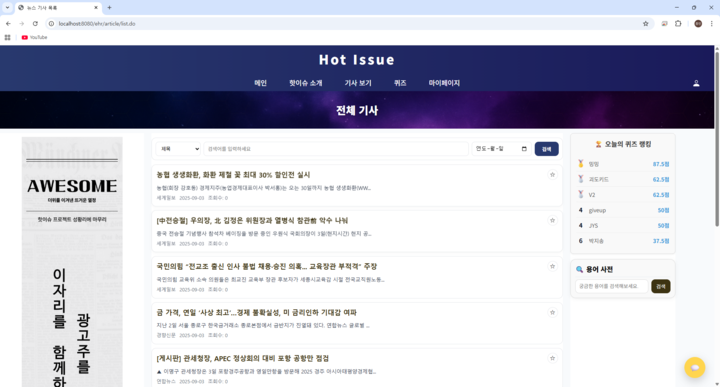

# 📰 Hot Issue
뉴스 요약 & 퀴즈 기반 참여형 뉴스 플랫폼  
팀명: **Awesome (어썸)**  
기간: **2025.07.15 ~ 2025.09.05**

---

## 1. 프로젝트 소개
### 1-2. 프로젝트 개요
### 1-3. 프로젝트 배경
### 1-4. 프로젝트 선정 기준
### 1-5. 기대 효과

---

## 2. 개발 환경 및 기술 스택

---

## 3. 프로젝트 팀 구성
| 이름 | 역할 |
|------|------|
| 이종민 (팀장) | 기획/분석 총괄, 회의록, 최종 발표, 전체 기사/카테고리별 기사 페이지, 챗봇 기능 |
| 가민경 | 기획 발표 |
| 임두나 | PPT, 회의록 |
| 이병헌 | WBS, 화면/파일 설계서, 기획 발표 |
| 양승현 | 기획서 작성 |
| 정유성 | 최종 발표 |

---

## 4. 프로젝트 수행 절차 및 방법
### 4-1. WBS (개발 일정)
👉 

### 4-2. 기능 정의서 & 요구사항
👉

---

## 5. 구현 결과 (기능별 화면)
### 5-1. 회원 기능
- 회원가입 (중복확인, 이메일 인증)
  

  

- 로그인
- 아이디/비밀번호 찾기

### 5-2. 관리자 기능
- 회원 관리 (검색, 등급 수정, 삭제)
- 기사 관리 (검색, 삭제)
- 신고 관리 (조회, 상태 변경)

### 5-3. 메인 페이지
- 카테고리별 키워드
- 카테고리별 추천 기사
- 유저별 맞춤 기사
- 날씨 API

### 5-4. 기사 기능
- 전체 기사 조회
- 카테고리별 기사
- 북마크 기능

### 5-5. 퀴즈 기능
- 일간/주간 퀴즈
- OX 형식 문제
- 랭킹 시스템

### 5-6. 사전 기능
- 네이버 지식백과 API
- 단어 검색 / 기사 내 단어 선택 검색

### 5-7. 커뮤니티 & 채팅
- 로그인 전: 읽기 전용
- 로그인 후: 실시간 채팅 + 댓글 신고

### 5-8. 마이페이지
- 내가 북마크한 기사
- 내가 남긴 댓글 관리
- 신고 내역
- 데이터 시각화 (차트, 워드 클라우드)

### 5-9. 챗봇
- 키워드/카테고리 질문
- 기사 추천 기능

👉 각 기능별 화면 캡쳐 넣으세요

---

## 6. 테스트 및 산출물
- **단위 테스트 & 통합 테스트**
  👉  
      
      
      
      

     

- **프로그램 사양서**
  👉 

- **GitHub Repository**: [Awesome GitHub Repo](https://github.com/hykim-king/awesome.git)

---

## 7. 시연 영상
👉 
